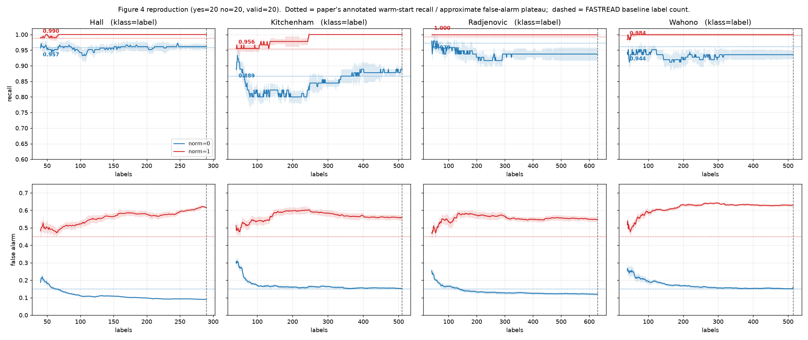

# Reproducing figure 4 of "Can AI be Easy?" (EZR §7)

Recall **and** false-alarm curves for the four SLR corpora, driven by a patched
scratch copy of `ezr.py` @ `500d1d4`. Upstream
(`src/ez_tool/textmine/vendor/ezr.py`) is untouched; every deviation is in
[`ezr_fig4.diff`](ezr_fig4.diff), reproduced in §1.

Provenance is marked throughout: **[code]** = measured from these runs,
**[paper]** = quoted from the paper or the task's reference targets,
**[inference]** = my reading of the two together.

Runs: `results/textmine/fig4_curves.csv` (4520 rows), figures in
`results/textmine/figures/`. Slurm array `scripts/slurm/run_fig4.sbatch`,
10 cells, ~1.2 CPU-hours, `PYTHONHASHSEED=0` (`_tm_best` breaks score ties by
dict order).

---

## 1. Diff against upstream `ezr.py`

Five hunks. One-line justification each:

| # | Change | Why |
|---|---|---|
| 1 | Add `--textmine.klass=label` to the `__doc__` options block | Makes the label column selectable instead of hardcoded; picked up by ezr's own `re.findall` option parser, so it needs no other machinery. |
| 2 | `tmPrepare(f, klass=None)` / `tmTokenize(..., klass=None)`, defaulting to `the.textmine.klass`, plus a `klass in hdr` assert | Kitchenham has two label columns; the run must be able to name which one it used rather than silently taking `label`. |
| 3 | `_tm_recall` returns `float` (`tp/(tp+fn)`) instead of `int(100*…)` | Figure 4's warm-start annotations are given to three decimals, so integer percent cannot express them. |
| 4 | New `_tm_falsealarm` returning `fp/(fp+tn)` over the full corpus, using the same `_tm_best` prediction | Figure 4's bottom row has no implementation anywhere in the commit. |
| 5 | `tmActive` records `(recall, false_alarm)` per step, aggregates median+IQR for both, and returns the table | The metric must be recorded on the same nested labelled sequence, and the table must be machine-readable to emit tidy CSV. |

`tmTokenize`'s `txt="abstract"` is left as upstream has it: the task does not
ask for it and keeping the diff minimal matters more. `document_title` is
therefore never read, as in upstream.

```diff
--- ezr_upstream.py	2026-09-02 14:38:42.201614478 -0400
+++ ezr_fig4.py	2026-09-02 14:39:24.878871804 -0400
@@ -22,6 +22,7 @@
     --textmine.no=20     negative samples
     --textmine.top=100   top TF-IDF features
     --textmine.valid=20  repeats for stats testing
+    --textmine.klass=label  CSV column holding the relevance label
 """
 from __future__ import annotations
 from time import perf_counter_ns as now
@@ -697,15 +698,17 @@
       if any(x.strip() for x in r):
         yield [thing(x.strip()) for x in r]
 
-def tmPrepare(f: str) -> S:
+def tmPrepare(f: str, klass: str = None) -> S:
   """Full text-mining pipeline."""
-  return tmTfidf(tmStem(tmNostop(tmTokenize(f))))
+  return tmTfidf(tmStem(tmNostop(tmTokenize(f, klass=klass))))
 
-def tmTokenize(f: str, txt: str = "abstract", klass: str = "label") -> S:
+def tmTokenize(f: str, txt: str = "abstract", klass: str = None) -> S:
   """Parse CSV, extract lowercase words of length > 2."""
+  klass = klass or the.textmine.klass
   p = S(docs=[], tf=[], df={}, tfidf={}, top=[])
   rows = tmCsv(f); hdr = next(rows)
   assert txt in hdr, f"need '{txt}' col (raw CSV?)"
+  assert klass in hdr, f"need '{klass}' col"
   t, k = hdr.index(txt), hdr.index(klass)
   for r in rows:
     ws = [w for w in re.findall(r'\b[a-zA-Z]+\b',
@@ -792,11 +795,17 @@
   """Class with highest CNB score for row."""
   return max(ws, key=lambda k: cnbLikes(ws, data, r, k))
 
-def _tm_recall(ws: dict, data: Data, key: int) -> int:
-  """Percent of positives correctly predicted."""
+def _tm_recall(ws: dict, data: Data, key: int) -> float:
+  """Fraction of positives correctly predicted: tp/(tp+fn)."""
   ps = [r for r in data.rows if r[key] == "yes"]
-  if not ps: return 0
-  return int(100 * sum(_tm_best(ws, data, r) == "yes" for r in ps) / len(ps))
+  if not ps: return 0.0
+  return sum(_tm_best(ws, data, r) == "yes" for r in ps) / len(ps)
+
+def _tm_falsealarm(ws: dict, data: Data, key: int) -> float:
+  """Fraction of negatives wrongly predicted yes: fp/(fp+tn)."""
+  ns = [r for r in data.rows if r[key] != "yes"]
+  if not ns: return 0.0
+  return sum(_tm_best(ws, data, r) == "yes" for r in ns) / len(ns)
 
 def _tm_iqr(vs: list) -> float:
   """Interquartile range."""
@@ -826,7 +835,7 @@
     lab = _tm_warm(pos, idx); pool = idx - lab; trail = []
     while True:
       ws = cnb(data, [data.rows[i] for i in lab])
-      trail.append(_tm_recall(ws, data, key))
+      trail.append((_tm_recall(ws, data, key), _tm_falsealarm(ws, data, key)))
       if len(lab) >= the.learn.budget or not pool: break
       pick_i = max(pool, key=lambda i:
         cnbLikes(ws, data, data.rows[i], "yes"))
@@ -836,12 +845,15 @@
   w0 = the.textmine.yes + the.textmine.no
   print(f"\n{'=' * 40}\nActive CNB {the.textmine.valid}x "
         f"warm={w0} B={the.learn.budget}\n{'=' * 40}")
-  rows = [["labeled", "pd", "iqr"]]
+  rows = [["labeled", "pd", "pd_iqr", "fa", "fa_iqr"]]
   for s in range(n):
-    vs = [t[s] for t in trails]; md = statistics.median(vs)
-    rows.append([w0 + s, md, _tm_iqr(vs) if len(vs) > 1 else 0])
-  _tm_align(rows)
-  return True
+    rs = [t[s][0] for t in trails]; fs = [t[s][1] for t in trails]
+    rows.append([w0 + s,
+                 statistics.median(rs), _tm_iqr(rs) if len(rs) > 1 else 0,
+                 statistics.median(fs), _tm_iqr(fs) if len(fs) > 1 else 0])
+  _tm_align([r if i == 0 else r[:1] + [round(v, 3) for v in r[1:]]
+             for i, r in enumerate(rows)])
+  return rows
 
 def _tm_align(rows: list) -> None:
   """Print list-of-lists as right-aligned table."""
```

---

## 2. The Kitchenham label column

Reported before anything was changed. Kitchenham is the only one of the four
corpora with two candidate columns; the other three have `label` only. **[code]**

| corpus | rows | column | `yes` | meaning |
|---|---:|---|---:|---|
| Hall | 8911 | `label` | 104 | — |
| **Kitchenham** | 1704 | **`abs`** | **132** | title-and-abstract review |
| **Kitchenham** | 1704 | **`label`** | **45** | content review |
| Radjenović | 6000 | `label` | 48 | — |
| Wahono | 7002 | `label` | 62 | — |

`tmPrepare` hardcodes `klass="label"`, so upstream reads the 45. Table 6 of the
paper reports 132 **[paper]**, which is `abs`. Both were run; §3 and §5 settle
which one figure 4 used.

---

## 3. Warm-start calibration

Budget set equal to the warm size, so `tmActive` emits exactly the warm-start
row. `valid=20`, median over 20 random warm starts, `seed=1`. Targets are
figure 4's own left-edge annotations **[paper]**; everything else is **[code]**.

### norm=0 (blue)

| config | warm | Hall | Kitchenham `label` | Kitchenham `abs` | Radjenović | Wahono | max \|Δ\| |
|---|---:|---:|---:|---:|---:|---:|---:|
| **target** | — | **0.958** | **0.867** | **0.867** | **0.972** | **0.961** | — |
| `yes=12 no=12` | 24 | 0.957 | 0.889 | 0.720 | 0.958 | 0.895 | 0.066 |
| **`yes=20 no=20`** | 40 | **0.957** | **0.889** | 0.735 | **0.979** | **0.944** | **0.022** |
| `yes=24 no=0` | 24 | 1.000 | 1.000 | 1.000 | 1.000 | 1.000 | degenerate |

### norm=1 (red)

| config | warm | Hall | Kitchenham `label` | Kitchenham `abs` | Radjenović | Wahono | max \|Δ\| |
|---|---:|---:|---:|---:|---:|---:|---:|
| **target** | — | **0.988** | **0.954** | **0.954** | **0.992** | **0.996** | — |
| `yes=12 no=12` | 24 | 0.990 | 0.933 | 0.822 | 0.990 | 0.968 | 0.028 |
| **`yes=20 no=20`** | 40 | **0.990** | **0.956** | 0.799 | **1.000** | **0.984** | **0.012** |
| `yes=24 no=0` | 24 | 1.000 | 1.000 | 1.000 | 1.000 | 1.000 | degenerate |

### `yes=24 no=0` does not crash — it degenerates

It was worth checking rather than assuming. `_tm_warm` calls
`random.sample(rest, min(0, len(rest)))`, which is a legal empty draw, so no
exception is raised. The warm set is 24 positives, `cnb` sees a single class,
and `_tm_best` is an argmax over `ws`'s keys — with one key it can only ever
return `"yes"`. Verified directly: **[code]**

```
yes=24 no=0 : warm=24  yes_in_warm=24 no_in_warm=0  cnb_classes=['yes']  distinct_predictions=['yes']
yes=20 no=20: warm=40  yes_in_warm=21 no_in_warm=19 cnb_classes=['no','yes'] distinct_predictions=['no','yes']
```

So it scores recall 1.000 on every corpus while flagging the entire corpus:
false alarm 1.000. **Recall alone would have made this the best-fitting
configuration of the three.** It is only excluded by the metric added in §1 —
a direct instance of the judgment rule that recall must never be reported
alone.

(The second line also confirms the negative draw is presumptive: 20 requested
negatives yielded 19 `no` and 1 `yes`.)

### Conclusion of §3

`yes=20 no=20` — the `ezr.py` default — is the best match on **both** curves,
and the fit is close: worst case +0.022 (blue, Kitchenham) and −0.012 (red,
Wahono). Every residual is inside the interquartile range of its own median
(blue IQRs 0.029–0.078). The paper's stated "N = 24" **[paper]** fits Hall and
Kitchenham but misses Wahono by −0.066 on the blue curve, so the code default,
not the prose, is what figure 4 was run with. **[inference]**

`klass=label` (45 positives) reproduces Kitchenham's annotation; `klass=abs`
(132) is off by **−0.13 blue and −0.16 red** and is ruled out. Figure 4's
Kitchenham panel used the 45-positive content-review column — i.e. `ezr.py`'s
hardcoded default — even though the paper's own Table 6 reports the 132.
**[inference]** See `figures/fig4_kitchenham_klass.png`.

---

## 4. Full curves

`yes=20 no=20`, `valid=20`, `norm ∈ {0,1}`, run to each panel's cap. Tidy CSV
in [`fig4_curves.csv`](fig4_curves.csv):

```
corpus,norm,klass_col,labelled,recall_median,recall_iqr,fa_median,fa_iqr
```



Value at each panel's cap, `klass=label`: **[code]**

| corpus | cap | recall blue | fa blue | recall red | fa red |
|---|---:|---:|---:|---:|---:|
| Hall | 290 | 0.962 | 0.090 | 1.000 | 0.616 |
| Kitchenham | 510 | 0.889 | 0.153 | 1.000 | 0.559 |
| Radjenović | 630 | 0.938 | 0.120 | 1.000 | 0.548 |
| Wahono | 515 | 0.935 | 0.157 | 1.000 | 0.630 |

False-alarm plateau, median over the final quarter of each curve, against the
paper's approximate levels **[paper]** of blue ≈ 0.15, red ≈ 0.45:

| corpus | fa blue | fa red |
|---|---:|---:|
| Hall | 0.092 | 0.597 |
| Kitchenham | 0.155 | 0.561 |
| Radjenović | 0.122 | 0.553 |
| Wahono | 0.153 | 0.629 |

---

## 5. Verdict

**`yes=20 no=20`, `klass=label`, `norm=0` for blue and `norm=1` for red
reproduces figure 4's warm-start row and its blue false-alarm plateau. The red
false-alarm plateau does not reproduce.** Residuals, signed, mine minus the
reference:

| quantity | reference **[paper]** | this run **[code]** | residual |
|---|---|---|---|
| warm-start recall, blue | 0.958 / 0.867 / 0.972 / 0.961 | 0.957 / 0.889 / 0.979 / 0.944 | −0.001 … **+0.022** |
| warm-start recall, red | 0.988 / 0.954 / 0.992 / 0.996 | 0.990 / 0.956 / 1.000 / 0.984 | −0.012 … **+0.008** |
| false-alarm plateau, blue | ≈ 0.15 | 0.092 … 0.157 | −0.058 … +0.007 |
| false-alarm plateau, red | ≈ 0.45 | 0.553 … 0.629 | **+0.103 … +0.179** |

Three of the four quantities land within sampling noise. The fourth does not:
**the red false-alarm plateau overshoots by +0.10 to +0.18 on all four
corpora** — same sign, same rough size everywhere, so it is a systematic offset
and not noise. Normalised CNB here flags 55–63% of each corpus, not the ~45%
figure 4 shows, and it is *rising* on Hall rather than flat.

Two further observations, both **[code]**:

- **Blue recall is not monotone; the warm-start row is a local maximum.**
  Kitchenham falls 0.889 → 0.800 by 79 labels and does not regain its
  warm-start value until 391. Radjenović falls to 0.917 by 206 and never
  returns (final 0.938 vs 0.979 at the warm start). Wahono dips to 0.911 by 46,
  recovers by 54, but still ends below its warm start (0.935 vs 0.944). Only
  Hall ends above (0.962 vs 0.957). The red curves are monotone
  non-decreasing: on all four, the minimum *is* the warm-start row.
  Greedy certainty sampling adds
  almost-exclusively positive rows, which shifts the complement statistics CNB
  is built from. **[inference]** This is why the calibration rule matters: at
  any x other than the left edge the acquisition policy is confounded with the
  warm start.
- **Red reaches recall 1.000 at every cap**, at a false alarm of 0.55–0.63.
  That is close to the degenerate `yes=24 no=0` classifier and reinforces the
  same point — on the red curve, recall carries almost no information.

### What is not established

- Which code produced figure 4. `500d1d4` computes no false alarm at all, so
  the bottom row of figure 4 cannot have come from it. My `_tm_falsealarm` is
  the natural `fp/(fp+tn)` reading over the same `_tm_best` prediction, but it
  is my definition, not the paper's — and a different denominator (e.g. over a
  hold-out rather than the full corpus) is the most likely single explanation
  of the red residual. **[inference]**
- The `label`-over-`abs` conclusion is inferred from a 0.13–0.16 recall gap at
  the warm start, which is large and consistent across both `norm` settings,
  but it is inference from the annotations, not a statement in the paper.
- `txt` remains `abstract`; titles are never read, matching upstream but not
  §7.4's prose.
